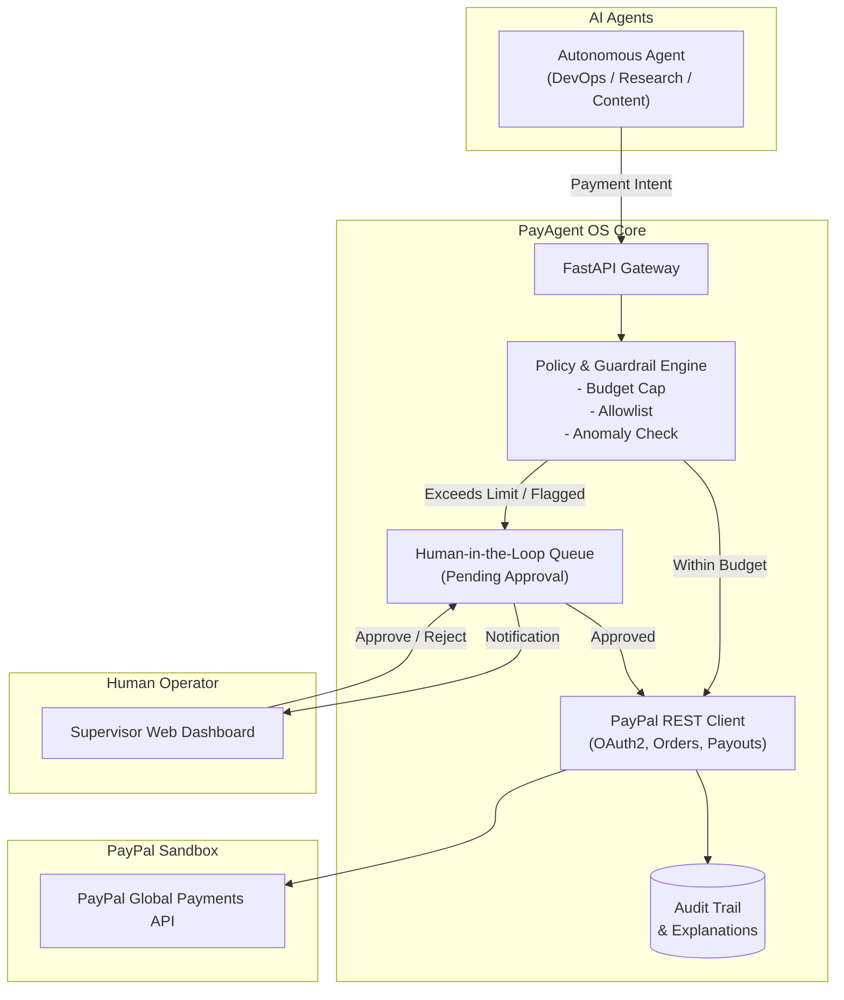

# PayAgent OS

> **Autonomous AI Agent Financial Wallet & Policy-Guided PayPal Orchestration Engine**
> 
> *Built for the **PayPal AI Hackathon 2026** on Devpost.*

[](LICENSE)
[](https://www.python.org/)
[](https://fastapi.tiangolo.com/)
[](https://developer.paypal.com/)
[](https://devpost.com/)

---

## Overview & The Problem

The agentic AI economy is rapidly arriving. Autonomous AI agents are writing code, configuring cloud environments, aggregating market research, and contracting micro-services.

However, **AI agents lack a secure, native financial execution layer**:
1. Giving an AI an unrestricted credit card is a major security and financial risk.
2. Requiring human approval for every single $0.50 API call or micro-procurement destroys agent autonomy.
3. Lack of an auditable financial trail leaves developers blind to why an agent made a payment.

---

## Solution: PayAgent OS

**PayAgent OS** turns PayPal into a programmable, policy-governed financial infrastructure for autonomous AI agents.

- **Autonomous Execution:** Agents self-execute routine, verified purchases within pre-approved thresholds.
- **Guardrail Policy Engine:** Enforces per-transaction caps, daily rolling budgets, vendor allowlists, and anomaly scoring.
- **Human-in-the-Loop (HITL):** High-value or anomalous transactions automatically pause into a live approval queue.
- **Explainability & Audit Trail:** Every transaction records the agent's identity, reasoning prompt, target vendor, and policy decision.
- **Direct PayPal Integration:** Powered by PayPal's Orders v2 API, Captures API, and Payouts API.

---

## Architecture



---

## Quick Start

### 1. Clone & Setup
```bash
git clone https://github.com/blosny/payagent-os.git
cd payagent-os

# Create virtual environment
python -m venv venv

# Windows
.\venv\Scripts\Activate.ps1
# Linux/macOS
source venv/bin/activate

# Install dependencies
pip install -r backend/requirements.txt
```

### 2. Configure Environment
```bash
cp .env.example .env
```
Edit `.env` with your PayPal Developer Sandbox credentials:
```env
PAYPAL_CLIENT_ID=your_sandbox_client_id
PAYPAL_CLIENT_SECRET=your_sandbox_client_secret
PAYPAL_MODE=sandbox
```
*(Note: If no credentials are provided, PayAgent OS automatically runs in safe **Simulation Mode** for instant local evaluation).*

### 3. Run Application
```bash
python backend/app/main.py
```
Visit:
- **Interactive Dashboard:** `http://localhost:8000`
- **Swagger API Docs:** `http://localhost:8000/docs`

### 4. Run Test Suite
```bash
pytest
```

---

## PayPal APIs Utilized
- **OAuth 2.0 Client Credentials:** Secure token generation and lifecycle management (`POST /v1/oauth2/token`).
- **Orders v2 API:** Order creation with line-item breakdowns (`POST /v2/checkout/orders`).
- **Capture API:** Immediate authorized settlement (`POST /v2/checkout/orders/{id}/capture`).
- **Payouts API:** Programmatic disbursement to contractors and external agents (`POST /v1/payments/payouts`).

---

## Author
- **Taha Buğra Çiçek** — Fırat University Computer Engineering
- GitHub: [@blosny](https://github.com/blosny)

---

## License
This project is licensed under the MIT License — see the [LICENSE](LICENSE) file for details.
