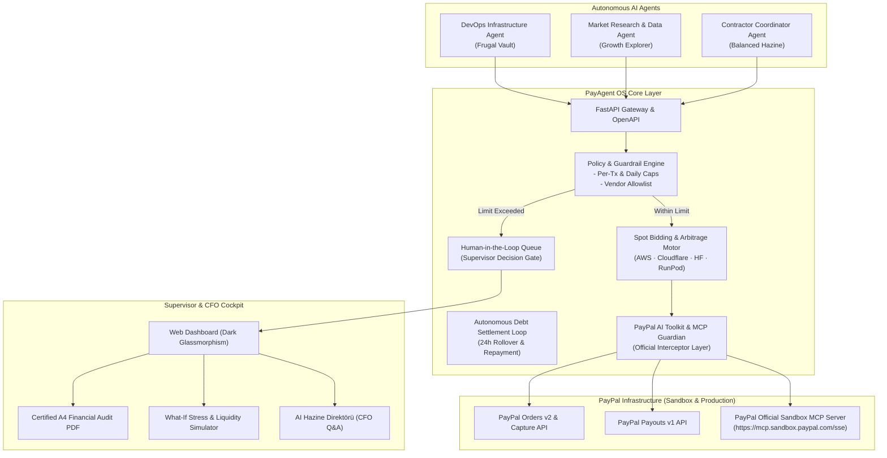

# PayPal PayAgent OS

> **Autonomous AI Agent Financial Wallet, Policy-Guided Guardrails & Cloud Arbitrage Engine**
> 
> *Built for the **PayPal AI Hackathon 2026** on Devpost.*

[](https://github.com/blosny/paypal-payagent-os/actions)
[](LICENSE)
[](https://www.python.org/)
[](https://fastapi.tiangolo.com/)
[](https://developer.paypal.com/)
[](https://github.com/paypal/AI-Toolkit)
[](tests/)

---

## The Core Vision & Problem

The agentic AI era is here: autonomous agents (Claude Code, Cursor, Devin, CrewAI, AutoGen) are provisioning cloud clusters, executing model fine-tuning, purchasing research datasets, and orchestrating contractors.

However, **organizations cannot safely give AI agents unrestricted corporate credit cards**:
1. **Uncontrolled Burn:** A single runaway loop or prompt injection can rack up a $50,000 AWS/API bill overnight.
2. **Autonomy Bottleneck:** Requiring human approval for every $1.00 routine compute task paralyzes agent efficiency.
3. **Black-Box Payments:** Unaudited transactions leave financial supervisors blind to why funds were spent.
4. **Static Pricing Inefficiency:** Agents purchase compute from a single hardcoded vendor, missing live spot market discounts.

---

## The 4 Core Pillars of PayAgent OS

PayAgent OS turns PayPal into an autonomous, safe, and intelligent financial operating system:

### 1. Enterprise Financial Guardrails & HITL State Machine
- **Dual-Threshold Control:** Routine micro-transactions within policy caps execute autonomously in seconds.
- **Human-in-the-Loop (HITL) Safety Gate:** Budget overruns, unrecognized vendors, or anomalous requests are frozen in a live supervisor queue for one-click authorization or reasoned rejection.
- **Complete Audit Trail:** Every transaction records the agent's identity, reasoning prompt, recipient, and cryptographic PayPal order ID.

### 2. Official PayPal AI Toolkit & Sandbox MCP Guardian Layer
- **Seamless Drop-In Adapter:** Directly wraps PayPal's official [`paypal/AI-Toolkit`](https://github.com/paypal/AI-Toolkit) and official Sandbox Model Context Protocol (MCP) server (`https://mcp.sandbox.paypal.com/sse`).
- **Active Interceptor:** When LangChain, CrewAI, or Cursor agents call official PayPal tools (`paypal_create_order`, `paypal_create_payout`), PayAgent OS intercepts and enforces enterprise policy rules before financial commitment.

### 3. Autonomous Capital Market (P2P Negotiation & Debt Settlement)
- **Behavioral Finance Personalities:** Agents possess distinct financial behaviors:
  - `FRUGAL_VAULT` (Cimri Birikim Kasası): Strictly preserves capital; only approves emergency requests marked `CRITICAL`.
  - `GROWTH_EXPLORER` (Ar-Ge & Büyüme): Generously fuels innovation and model testing.
  - `BALANCED_COORDINATOR` (Dengeli Hazine): Rational risk analyzer for freelance payouts.
- **Internal Debt Settlement Loop:** Borrowed compute quotas are registered into an autonomous debt ledger and repaid upon daily quota reset.

### 4. Autonomous Cloud/GPU Spot Bidding & Arbitrage Engine
- **Live Market Surveillance:** Real-time spot price board tracking AWS Bedrock, Cloudflare Workers AI, HuggingFace Endpoints, RunPod GPU Spot, and DeepInfra.
- **Dynamic Auction Solicitation:** Solicits competitive quotes based on agent workload (GPU Inference, Fine-Tuning, Embeddings, Serverless) and strategy (`COST_FIRST`, `SPEED_FIRST`, `BALANCED`).
- **Arbitrage Alpha Capture:** Automatically routes procurement to the winning provider via PayPal Orders v2 Sandbox, capturing net dollar savings (`saved_amount`) directly into the corporate treasury.
- **Day/Night Liquidity Rebalancer:** Automatically shifts idle daytime quotas to nocturnal batch-training agents.

---

## Architecture



---

## Quick Start

### 1. Clone & Setup
```bash
git clone https://github.com/blosny/paypal-payagent-os.git
cd paypal-payagent-os

# Create virtual environment
python -m venv venv

# Windows
.\venv\Scripts\Activate.ps1
# Linux / macOS
source venv/bin/activate

# Install dependencies
pip install -r backend/requirements.txt
```

### 2. Configure Environment
```bash
cp .env.example .env
```
Edit `.env` with your PayPal Developer Sandbox credentials:
```env
PAYPAL_CLIENT_ID=your_sandbox_client_id
PAYPAL_CLIENT_SECRET=your_sandbox_client_secret
PAYPAL_MODE=sandbox
```
*(Note: If credentials are not provided, PayAgent OS automatically engages Simulation Mode for full local testing).*

### 3. Run Application
```bash
uvicorn backend.app.main:app --reload --port 8000
```
Open:
- **Interactive Dashboard:** `http://localhost:8000`
- **Swagger REST API Docs:** `http://localhost:8000/docs`

### 4. Run Test Suite
```bash
pytest tests/ -v
```
*(All 30 unit, policy, toolkit and arbitrage tests pass in under 1 second).*

---

## PayPal Technologies Utilized
- **PayPal Orders v2 API:** `POST /v2/checkout/orders`
- **PayPal Capture API:** `POST /v2/checkout/orders/{id}/capture`
- **PayPal Payouts API:** `POST /v1/payments/payouts`
- **PayPal OAuth 2.0 Client Credentials:** `POST /v1/oauth2/token`
- **Official PayPal AI Toolkit (`paypal/AI-Toolkit`):** Integrated via Guardian Adapter.
- **PayPal Sandbox MCP Server:** SSE endpoint `https://mcp.sandbox.paypal.com/sse`.

---

## Author
- **Taha Buğra Çiçek** — Fırat University, Computer Engineering (Senior)
- GitHub: [@blosny](https://github.com/blosny)

---

## License
This project is licensed under the MIT License — see the [LICENSE](LICENSE) file for details.
